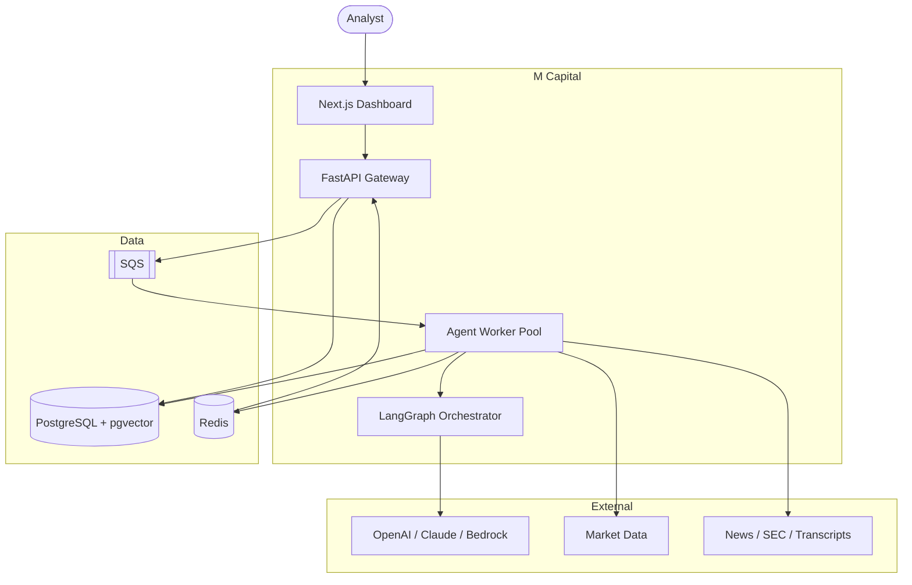

# M Capital — Architecture

> Multi-agent AI investment research platform. Event-driven, cloud-native, auditable.

## Contents
- [System context](#system-context)
- [Container architecture](#container-architecture)
- [Agent orchestration (LangGraph)](#agent-orchestration)
- [Event-driven execution](#event-driven-execution)
- [Scaling bottlenecks](#scaling-bottlenecks)
- [Data model](data-model.md)

## System context



## Container architecture

Three deployables, each scaling on its true bottleneck:

- **api-gateway** (FastAPI): stateless REST + auth + enqueue. Scales on RPS/CPU. Never imports LangGraph.
- **agent-worker**: SQS consumer running the LangGraph graph. **Scales on queue depth.**
- **performance-worker**: scheduled; computes realized returns and agent correctness.

A separate **stream-service** fans out live progress (Redis pub/sub → SSE/WebSocket),
so long-lived connections don't corrupt the gateway's autoscaling signal.

## Agent orchestration

Two phases: independent analysis → bounded debate → synthesis.

```mermaid
stateDiagram-v2
    [*] --> DataGather
    state "Phase 1: parallel" as P1 {
        DataGather --> News
        DataGather --> Financial
        DataGather --> Quant
        DataGather --> Macro
        DataGather --> Risk
        News --> Barrier
        Financial --> Barrier
        Quant --> Barrier
        Macro --> Barrier
        Risk --> Barrier
    }
    Barrier --> ConflictDetect
    state "Phase 2: debate" as P2 {
        ConflictDetect --> DebateRound
        DebateRound --> DebateRound: unresolved & round<max
    }
    ConflictDetect --> Synthesis: no conflict
    DebateRound --> Synthesis: converged/max
    Synthesis --> PortfolioManager --> Persist --> [*]
```

- **Barrier fan-in**; per-agent timeout → `abstained` rather than failing the run.
- **Debate is convergence-gated & round-capped**; the Risk Officer is a permanent adversary to prevent groupthink.
- **State externally checkpointed** in Postgres so a dead worker's run resumes.
- **Structured outputs** validated against the Pydantic contracts; invalid → one repair → abstain.

## Event-driven execution

- API returns `202` + `stream_url`; work is enqueued, not held on the HTTP connection.
- **Idempotency:** every message carries a key; workers dedupe via Redis `SETNX` on `request_id:node`.
- **Backpressure:** SQS depth drives ECS target-tracking autoscaling of workers.
- **DLQ + replay** for poison messages.

## Scaling bottlenecks

The system is **rate-limit- and cost-bound before it is compute-bound.**

| Bottleneck | Mitigation |
|---|---|
| LLM TPM / rate limits | multi-provider routing, per-run token budgets, tool-result caching |
| Postgres connections | PgBouncer (transaction pooling), short-lived sessions |
| pgvector recall latency | HNSW tuning; dedicated vector DB beyond ~1M vectors |
| Debate cost explosion | bounded rounds + convergence gate |
| SSE connection ceiling | dedicated stream-service + Redis pub/sub + polling fallback |
| Tail latency (slowest agent) | per-agent timeout → abstain |

## Architecture Decision Records

ADRs live in [`docs/adr/`](../adr/). Notable: monorepo, LangGraph orchestration,
TEXT+CHECK enums, ports & adapters for LLM/queue/secrets.
