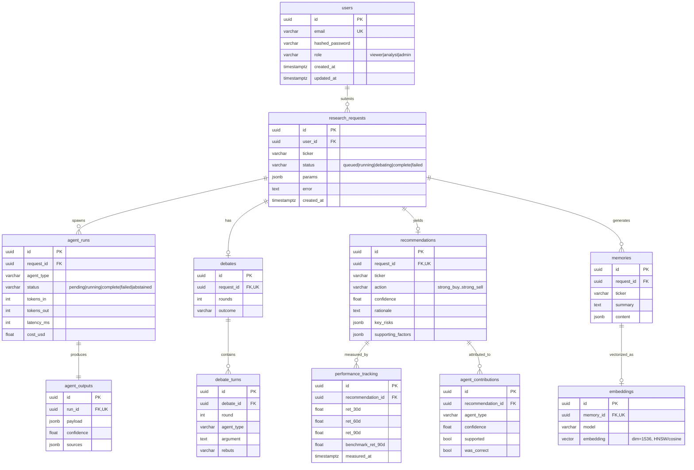

# Data Model & ER Diagram

Canonical schema for Aegis Capital. Source of truth: SQLAlchemy models in
[`packages/aegis_shared/aegis_shared/db/models.py`](../../packages/aegis_shared/aegis_shared/db/models.py),
materialized by the Alembic migration
[`0001_initial_schema.py`](../../db/migrations/versions/0001_initial_schema.py).

## Entity–Relationship Diagram

## Key design decisions

| Decision | Rationale | Limitation / future |
|---|---|---|
| **UUIDv7 PKs** (app-generated) | Time-sortable → less index fragmentation & write hotspotting than v4 | Slightly larger than bigint; DB default `gen_random_uuid()` is v4 fallback |
| **TEXT + CHECK for enums** | Adding a value is a trivial migration; native PG `ENUM` `ALTER TYPE ADD VALUE` can't run in a txn | No DB-level type object; app enums are the vocabulary |
| **JSONB for agent payloads** | Each agent has a different shape; validated by Pydantic at the boundary | Not queryable by typed columns; add GIN index if we filter on payload |
| **1:1 `agent_runs` ↔ `agent_outputs`** | Separates *telemetry* (always present) from *result* (absent on failure/abstain) | Extra join; worth it for clean failure modeling |
| **`uq_agent_run_per_request(request_id, agent_type)`** | One run per agent per request; enables idempotent upserts on SQS redelivery | Re-runs need an explicit new request |
| **HNSW cosine index on `embeddings`** | Best recall/latency for read-heavy semantic retrieval | Rebuild cost on bulk load; >~1M vectors → dedicated vector store |
| **`agent_contributions.was_correct` nullable** | Correctness is unknown until the outcome window (90d) elapses | Backfilled by `performance-worker` |

## Lifecycle of a request

1. `research_requests` row inserted (`status=queued`) → SQS message enqueued.
2. Worker creates 5 `agent_runs` (`status=running`), each writing one `agent_outputs`.
3. If score variance high → `debates` + `debate_turns` (`status=debating`).
4. Portfolio Manager writes `recommendations` + `agent_contributions` (`status=complete`).
5. A `memories` + `embeddings` pair is written for future semantic recall.
6. Later, `performance-worker` fills `performance_tracking` and sets
   `agent_contributions.was_correct`, powering the leaderboards.
